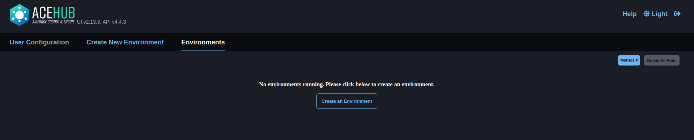

# ACE Hub SafeRL Quickstart

These instructions give a brief overview of how to set up and run the
saferl package within the ACE Hub deployment hosted on Google Cloud.

## ACE Hub Setup

The following instructions are taken from the ACE Hub [documentation](https://hub.ace.afresearchlab.com/docs/).
Please refer to the official documentation for updates.

### Login

#### On-Prem (preferred)

Begin by logging in to the ACE Hub deployment front end found [here](https://hub.lynx.act3-ace.ai/)
using your ACT3 afresearchlab account credentials.

#### Google Cloud Platform (if needed)

Begin by logging in to the afresearchlab ACE Hub deployment front end found [here](https://hub.ace.afresearchlab.com/)
using your Google afresearchlab account credentials.


If you successfully log in, you should be met by the following page:




### Git Configuration

NOTE: The following steps in this section only need to be performed
once per ACE Hub account.

To gain access to GitLab, you must register your Git credentials with
your ACE Hub account through a Personal Access Token.

To get a Personal Access Token use the following instructions:

<ol>
<li>Log into GitLab.</li>
<li>In the upper-right corner, click your avatar and select Preferences.</li>
<li>On the User Settings menu, select Access Tokens.</li>
<li>Choose a name and optional expiry date for the token.</li>
<li>Choose the desired scopes.</li>
<li>Click the "Create personal access token" button.</li>
<li>Save the Personal Access Token somewhere else. Once you leave
or refresh the page, you won't be able to access it again.</li>
</ol>

Once you have your Personal Access Token, navigate to the "User Configuration" page
on ACE Hub:


In the Environment Variables panel, click the "+" button to add a
new environment variable:


Set the Key field to ```GIT_PASSWORD```, enter your Git Personal 
Access Token into the Value field, and press the Save button:


Once the ```GIT_PASSWORD``` environment variable is set, you must
create an environment file which will be used by the pods you create
to access GitLab. You can create this file in the Environment Files
panel:


Click the "Preset Files..." dropdown menu and select "Git".
This will auto-populate the Key and Value fields for a new file:


Press the Save button to save this file to your User Configuration.

This completes the Git Configuration for your ACE Hub user account.
This step only needs to be done once per ACE Hub account.


### Creating an Environment

ACE Hub works under the principle that compute resources should accessed
when needed and released when finished. This paradigm is enforced through
the uses of "pods".

A pod is an isolated environment with a set of allocated
compute resources which could contain multiple individual environment containers.

To create a pod environment, first click the "Create an Environment" button or
navigate to the "Create New Environment" page:


From here you can load one of several available environment templates.
Loading an environment template will populate the fields on the right
side of the page. You can also edit any of these fields at any time.

As an example, load the ```jupyter-base-lab``` environment:


If you are using the ray/rllib framework with the saferl package,
make sure to increase the size of the shared memory field in the
Resources pane. RLLib requires more than the default 64Mi of shared memory to run:


In this example, we have created a template for a JupyterLab container
with 4 CPUs, 4GB of RAM, and 2GB of shared memory. We can save this
template with the "Save as Launch Template" button or directly launch
or environment with the "Launch" button.

Launching the environment will initialize a new pod which can be viewed
on the "Environments" page:


Once the environment is ready, the Pending status icon will change to
a green Ready icon. The environment can now be entered by opening the
dropdown pane and selecting "Open UI":


As this is a JupyterLab environment, the browser UI should look similar
to the image below:


To open a terminal in the environment, click the "Terminal" button
under "Other" in the "Launcher" tab:


### Setting Up The Environment for SafeRL

The following steps show how to set up the ACE Hub JupyterLab environment for use with
the saferl package. All of the following commands should be run in
the JupyterLab environment Terminal tab.

#### Installing libglib2.0 library

NOTE: The saferl package requires a system library not available
by default in the example JupyterLab environment. 

Run the following command and follow the prompts to install the
required libglib2.0 system library on the JupyterLab environment:

```shell
sudo apt update && sudo apt install -y libglib2.0-0
```

#### Downloading the saferl package from Git

The example ACE Hub JupyterLab environment does not come with
```git``` installed by default. Installing the saferl package from
the have-deepsky repository requires first installing ```git``` into the
JupyterLab environment before cloning the remote repository.

Installing ```git``` into the JupyterLab environment can be done
using the following command:

```shell
sudo apt update && sudo apt install -y git
```

Once ```git``` is installed, clone the have-deepsky repository 
into the JupyterLab environment:

```shell
git clone https://git.act3-ace.com/rta/have-deepsky.git
```

You should now see the have-deepsky directory in your environment.


#### Setting up a new conda environment

It is a good practice to perform Python development work within an
isolated virtual environment to prevent conflicts between Python
packages and dependencies. The example JupyterLab environment comes
with the virtual environment manager ```conda``` installed by default.
You can use ```conda``` to easily create a new virtual development
environment that manages your packages and dependencies (read more
about the Conda project [here](https://docs.conda.io/en/latest/)).

Use the following command to create a new ```conda``` environment 
with Python 3.7 and the Pip package manager installed (replace
```<env_name>``` with whatever you want to name your Conda
environment):

```shell
conda create -y -n <env_name> python=3.7 pip
```

It is important to use Python 3.7 as this version is required to
install some of the dependencies in the saferl package.

Once you create your environment, you must activate it using:

```shell
conda activate <env_name>
```

If you have correctly activated your new environment, the Terminal
tab prompt should look like this:


### Installing the saferl package

Assuming you are in an environment with Python 3.7 and Pip, you can
install the saferl package using the following commands:

```shell
cd path/to/have-deepsky/
pip install .
```

where ```path/to/have-deepsky/``` is the path to the have-deepsky directory
in your JupyterLab environment. This will perform a local Pip install
of the saferl package.

If you plan to develop in the saferl package, you can use the
following command instead to install an editable version of the
package:

```shell
pip install -e .
```

Congratulations, you should now have the saferl package installed
on your ACE Hub JupyterLab environment!

If you want to try out training a model, you can execute the following
command from the have-deepsky directory:

```shell
python scripts/train.py --workers 3
```

This will train a model in a spacecraft docking environment using
all of the available CPUs on our example node (3 worker CPUs + 1 
main training driver CPU).

Use the command:

```shell
python scripts/train.py --help
```

to see what other options you can pass to the training script. For
example, if you want to specify a different training configuration
file you can pass the ```--config``` argument as shown below:

```shell
python scripts/train.py --config configs/docking/docking_default.yaml --workers 3
```

See the rest of our [documentation](../../docs) for more details.

