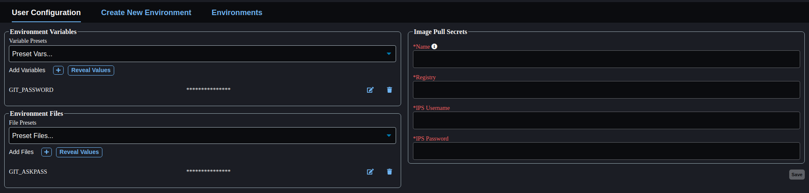
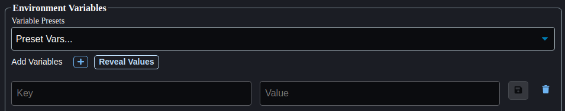

# Environment Setup Scripts

Adding environment setup scripts to your ACE Hub User Configuration
helps facilitate easy environment creation and setup.

To add an environment setup script, navigate to the "User
Configuration" page on ACE Hub:



In the Environment Files panel, click the "+" button to add a
new environment file:



In the Key field, enter a descriptive name for your script. In the
Value field, copy and paste the appropriate script based on your
environment type:

#### VSCode

```bash
eval "$(command conda 'shell.bash' 'hook' 2> /dev/null)"
export GIT_ASKPASS="/ace/hub/envfile/GIT_ASKPASS" 
conda create -y -n saferl_env python=3.7 pip
conda activate saferl_env
git clone https://git.act3-ace.com/rta/have-deepsky.git
cd have-deepsky/
pip --default-timeout=1000 install -e .
conda init bash && exec bash
```

#### JupyterLab

```bash
eval "$(command conda 'shell.bash' 'hook' 2> /dev/null)"
sudo apt update && sudo apt install -y libglib2.0-0
sudo apt update && sudo apt install -y git
conda create -y -n saferl_env python=3.7 pip
conda activate saferl_env
git clone https://git.act3-ace.com/rta/have-deepsky.git
cd have-deepsky/
pip --default-timeout=1000 install -e .
```

You will need to create an environment file for each type of script
you use. It is recommended to create one each for VSCode and JupyterLab
with descriptive file names distinguishing them (ex.
```SAFERL_VSCODE_SETUP``` or ```SAFERL_JUPYTERLAB_SETUP```).
