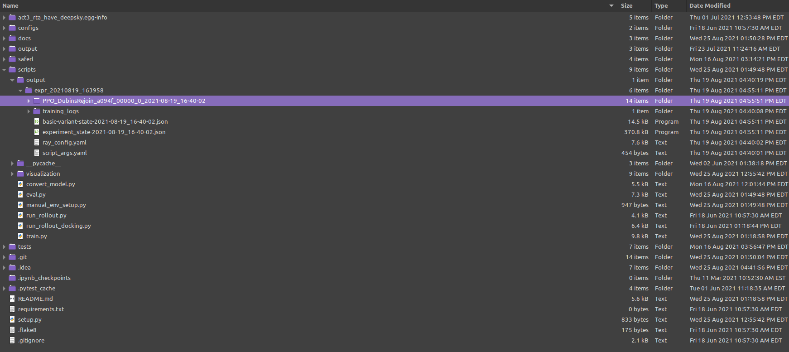

#Policy Evaluation and Animation

## Training Output

After training a policy on an environment of your choosing, typically using the train.py module 
from the `scripts/` directory, a training output directory will be created at the path 
`scripts/output/expr_[date]_[time]`. Inside this output directory, relevant training data 
will be stored including episode logging, config files, and checkpoints of policy parameter values. 
Policy checkpoints may be found inside the experiment directory, which will follow the naming convention
of `[RL Algorithm]_[environment name]_[experiment ID]_[date]_[time]`.

Copy the full path to your experiment directory, or one of the training checkpoints directories
therein.

## Evaluation

Also residing in the `scripts/` directory, eval.py may be used to run post hoc evaluation
rollouts to benchmark your trained policy. From the `/scripts/` directory, run the following
command:

`$ python eval.py --dir full/path/to/experiment_directory/or/checkpoint_directory`

This will load in the policy and environment with the same configuration from training and run
ten rollout episodes. The logs of these evaluation episodes are stored in a new directory, which
may be found at `path/to/experiment_directory/eval/ckpt_[checkpoint number]`.

## Animation

For visual intuition, our 2D base environments come with builtin animations. You may customize 
the animations by specifying `render` initial conditions in your config file (see config 
documentation).

To use our default renderers, for 2D Rejoin and 2D Docking tasks, simply add the `--render`
flag to the evaluation script launch from above:

`$ python eval.py --dir full/path/to/experiment_directory/or/checkpoint_directory --render`

You may also create your own custom animations by extending the BaseRenderer class and passing
it to the environment in the config.
